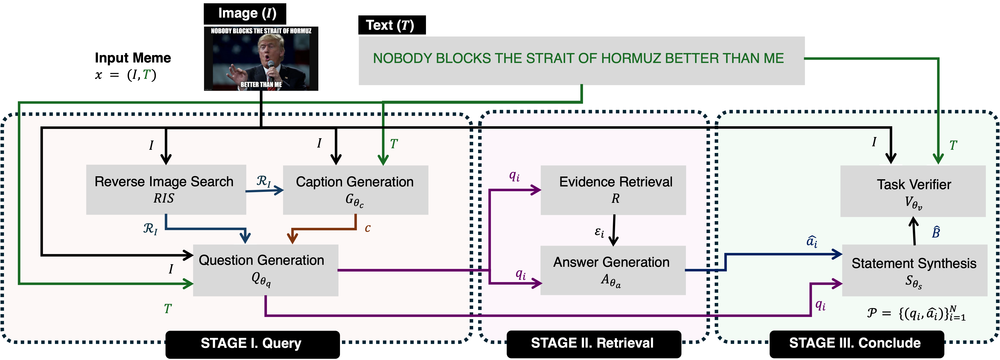

# [EMNLP 2026] I Know What You Meme, Even If it Emerged Today: Understanding Evolving Memes through Open-World Knowledge Acquisition

**Shanhong Liu<sup>1</sup>, Rui Cao<sup>1</sup>, Pai Chet Ng<sup>2</sup>, De Wen Soh<sup>1</sup>**

<sup>1</sup> Singapore University of Technology and Design  
<sup>2</sup> Singapore Institute of Technology  

## Overview

<p align="center">
  
</p>

Multimodal memes are dynamic and often require up-to-date background knowledge for interpretation. Existing methods often overlook such knowledge or rely on the fixed parametric knowledge of pre-trained models, which may be incomplete, outdated, or unavailable for emerging memes. We introduce **Query-Retrieve-Conclude**, a zero-shot framework that identifies missing knowledge, retrieves open-web evidence, and synthesizes evidence-grounded background knowledge for meme understanding and detection. We also introduce a curated meme understanding benchmark of recent memes from 2024–2026 with external background knowledge annotations. Experiments on three meme understanding datasets and five meme detection tasks show that our framework improves knowledge recovery, meme understanding, and downstream detection over zero-shot baselines.

## Directory Structure

```text
query-retrieve-conclude/
├── .env.example
├── .gitignore
├── README.md
├── requirements.txt
│
├── figures/
│   └── QRC.png
│
└── scripts/
    ├── config.py
    ├── utils.py
    ├── prompt_templates.py
    ├── zeroshot.py
    ├── qwen_helpers.py
    ├── gemma_helpers.py
    │
    ├── query/
    │   ├── upload_img.py
    │   ├── ris.py
    │   ├── prepare_ris.py
    │   ├── cap_generation.py
    │   └── que_generation.py
    │
    ├── retrieve/
    │   ├── wst.py
    │   └── ans_generation.py
    │
    ├── conclude/
    │   └── stat_generation.py
    │
    ├── eval/
    │   └── eval_stat.py
    │
    └── detection/
        └── predict_withbks.py
```

---

## Environment

The released implementation was tested with:

- Python 3.10.12
- PyTorch 2.10.0
- Transformers 5.6.2

Install the required dependencies with:

```bash
pip install -r requirements.txt
```

---


# Data Preparation

We evaluate Query-Retrieve-Conclude on both meme understanding datasets and downstream meme detection tasks.

## Meme Understanding Datasets

We use three meme understanding datasets:

1. **KYM** is our curated benchmark for evaluating newly emerging memes, containing 100 memes collected from [Know Your Meme](https://knowyourmeme.com/) and covering meme series from 2024 to 2026. Each meme is manually annotated with external background knowledge, intent, and an offensiveness label. 

    Downloading [KYM](https://drive.google.com/file/d/1tcacx1IO6kDkRi-zTfqVmNCt6auiSaQi/view?usp=drive_link).

2. [MemeIntent](https://aclanthology.org/2024.sigdial-1.54/)
3. [MemeInterpret](https://aclanthology.org/2025.findings-emnlp.871/)
---

## Prepare Meme Understanding Data

For each dataset, please organize the data foder as the following general structure:

```text
data/<dataset_name>/
├── images/
├── <dataset_name>_qg.json
└── <dataset_name>_eval.json
```

The two annotation files serve different purposes:

- `<dataset_name>_qg.json`
  - image filename;
  - OCR-extracted meme text;
  - used as input to the Query stage.

- `<dataset_name>_eval.json`
  - reference background knowledge annotations;
  - used to evaluate the QA-pairs converted background knowledge and detection tasks.

---

## Downstream Meme Detection Data

Our downstream detection setup is inspired by [GOAT-Bench](https://dl.acm.org/doi/epdf/10.1145/3729239).

The detection datasets are categorized according to five types of social abuse:

- harmfulness
- hatefulness
- misogyny
- offensiveness
- sarcasm


---

# Run Query-Retrieve-Conclude
---

## Stage 1. Query

### 1.1 Upload Meme Images

The reverse image search stage first uploads meme images.

First set the API key.

Then run:

```bash
python scripts/query/upload_img.py \
    --dataset kym
```

---

### 1.2 Reverse Image Search

Set the GoogleSearchAPI key:

```bash
export GoogleSearchAPI_KEY="YOUR_GOOGLE_SEARCH_API_KEY"
```

Run:

```bash
python scripts/query/ris.py \
    --dataset kym
```

---

### 1.3 Prepare Reverse Image Search Results

```bash
python scripts/query/prepare_ris.py \
    --dataset kym
```

---

### 1.4 Caption Generation

```bash
python scripts/query/cap_generation.py \
    --dataset kym \
    --selected_model QWEN3-32B
```

---

### 1.5 Question Generation

```bash
python scripts/query/que_generation.py \
    --dataset kym \
    --selected_model QWEN3-32B
```

---

## Stage 2. Retrieve

### 2.1 wst

```bash
python scripts/retrieve/wst.py \
    --dataset kym
```

---

### 2.2 Evidence-grounded Answer Generation

```bash
python scripts/retrieve/ans_generation.py \
    --dataset kym \
    --selected_model QWEN3-32B \
```
---

## 3. Conclude (Convert QA-pairs to background knowledge statements)


```bash
python scripts/conclude/stat_generation.py \
    --dataset kym \
```

---

# Background Knowledge Evaluation

 We perform reference-based evaluation by comparing the QA-pair converted evidence statements with the ground-truth evidence annotations.

The evaluation prompt is defined in:

```text
scripts/prompt_templates.py
```

and the evaluator is implemented in:

```text
scripts/eval/eval_stat.py
```

Set the evaluator API key:

```bash
export GEMINI_API_KEY="YOUR_GEMINI_API_KEY"
```

Then run:

```bash
python scripts/eval/eval_stat.py \
    --pred_path <PREDICTION_JSON> \
    --ref_path <REFERENCE_JSON> \
    --save_path <DETAIL_OUTPUT_JSON> \
    --avg_save_path <AVERAGE_OUTPUT_JSON>
```

---

# Downstream Meme Detection

```text
scripts/detection/predict_withbks.py
```

The downstream models used in our experiments are:

- **LLaVA-1.5-7B**
- **Qwen3-VL-8B**
- **Gemma3-12B**

The five downstream detection tasks evaluated in our experiments are:

- harmfulness
- hatefulness
- misogyny
- offensiveness
- sarcasm

For example, to perform hatefulness detection with Qwen3-VL-8B:

```bash
python scripts/detection/predict_withbks.py \
    --model_family qwen_vl \
    --model_path Qwen/Qwen3-VL-8B-Instruct \
    --dataset_name <DATASET_NAME> \
    --task_name hatefulness \
    --input_json <INPUT_JSON> \
    --statement_json <STATEMENT_JSON> \
    --image_root <IMAGE_ROOT> \
    --output_json <OUTPUT_JSON> \
    --device cuda
```

---

# Citation

Please cite our paper if you use Query-Retrieve-Conclude or the KYM dataset in your work:

```bibtex
@article{liu2026know,
  title={I Know What You Meme, Even If it Emerged Today: Understanding Evolving Memes through Open-World Knowledge Acquisition},
  author={Liu, Shanhong and Cao, Rui and Ng, Pai Chet and Soh, De Wen},
  booktitle={Proceedings of the 2026 Conference on Empirical Methods in Natural Language Processing},
  year={2026}
}
```

Part of our work builds on the following work:

```bibtex
@article{cao2026averimatec,
  title={AVerImaTeC: A Dataset for Automatic Verification of Image-Text Claims with Evidence from the Web},
  author={Cao, Rui and Ding, Zifeng and Guo, Zhijiang and Schlichtkrull, Michael and Vlachos, Andreas},
  journal={Advances in Neural Information Processing Systems},
  volume={38},
  year={2026}
}
```
